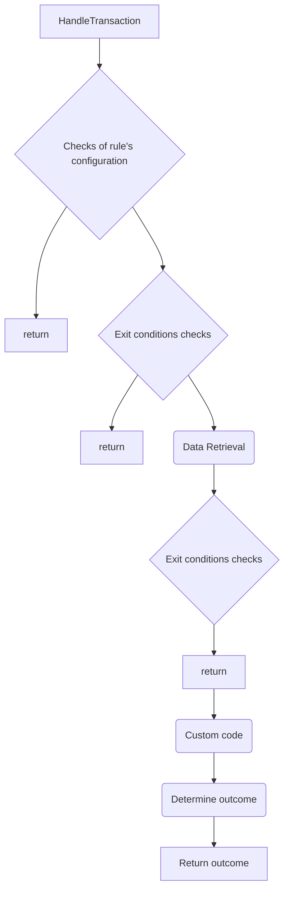

# Rule 901 Documentation
# Overview

Rules in the system has as small a purpose as possible and seeks to answer a single and very specific behavioural question about the transaction it is evaluation

| Title | Derived account age - creditor 
| ------ | ------ |
| `Perspective` | Creditor |
| `Historical depth` | Full system history to date |
| `Behaviour Focus` | Fraud/AML |
| `Description` | Models the "age" of the account based on available transacting behavior over the life of the platform |
| `Rule result type` | Banded |

| Query Parameters |  |
| ------ | ------ |
| 1 |  |

| Exit Conditions |  |
| ------ | ------ |
| .x00 |  |
| .x01 |  |
| 1 |  |

## Prerequisites
Before using the rule libraries, ensure you have the following prerequisites installed:
- Node.js and npm (Node Package Manager)
- Basic understanding of Node.js development
- Setup a GitHub Token (you can follow this [link](https://github.com/frmscoe/docs/blob/dev/Knowledge-Articles/How-To-Use-.npmrc-To-Hide-Secrets.md))

## Installation
To install a rule library, use npm:

```bash
npm install @frmscoe/rule-901@latest 
```

Option: Replace `latest` with a specific version of the rule available.


## handleTransaction Function
##### Description
The `handleTransaction` function processes a transaction according to the rules defined in the rule library.

##### Parameters
- **req**: `RuleRequest` - The request object containing transaction information.
- **determineOutcome**: `(value: number, ruleConfig: RuleConfig, ruleResult: RuleResult) => RuleResult` - A function used to determine the outcome of the transaction based on the provided value, rule configuration, and current rule result.
- **ruleResult**: `RuleResult` - The current result of applying rules to the transaction.
- **loggerService**: `LoggerService` - An instance of the logger service for logging purposes.
- **ruleConfig**: `RuleConfig` - Configuration settings for the rules to be applied.
- **databaseManager**: `DatabaseManagerInstance<ManagerConfig>` - An instance of the database manager for accessing and managing data.

##### Return Value
- `RuleResult` - The updated result after processing the transaction.


## Common Trends:
1. **Configuration Validation**: Each rule starts with validation checks for the provided configuration. If essential configuration parameters are missing, an error is thrown to indicate an invalid configuration.

2. **Exit condition before retrivial of data**: The payload data is checked for specific values that have been configured as exit conditions. If any of the checks meet the criteria of the exit condition, the rule responds with the result of the exit condition that was configured as part of the rule configuration.

3. **Data Retrieval**: The rules retrieve necessary data from external sources, such as a database. This data includes transaction details, timestamps, and other relevant information required for rule evaluation.

4. **Error Handling**: Comprehensive error handling is implemented throughout the rule logic. Errors related to missing configuration, data retrieval failures, or unexpected data types are caught and appropriately handled, ensuring robustness and reliability.

5. **Time Calculations**: Time calculations play a crucial role in rule evaluation. The rules calculate time differences between various transaction events and the current time to determine the validity of certain conditions.

6. **Exit condition after retrivial of data**: The returned data from data retrieval is checked before determining the value using the determine outcome function; these checks are configured to verify whether the returned value applies to any of the configured exit conditions. more about exit conditions follow this [link](https://github.com/frmscoe/docs/blob/main/Technical/Processors/Rule-Processors/standard-rule-processor-exit-and-error-conditions.md)

7. **Outcome Determination**: After gathering relevant data and performing necessary calculations, the rules delegate the final outcome determination to an external function (`determineOutcome`). This function evaluates the calculated parameters against the rule configuration and returns the result.

To read more about what can be more common about rules follow this [link](https://github.com/frmscoe/docs/blob/main/Product/rule-processor-overview.md)



## Publishing Rule Library

To publish the Rule library, you need to set up a continuous integration (CI) workflow that builds and publishes the library automatically whenever changes are pushed to the `main` branch. Below is an example workflow configuration using GitHub Actions:


#### Workflow Explanation:

1. **Trigger**: The workflow is triggered on `push` events to the `main` branch.

2. **Jobs**: Contains a single job named `build-and-publish`.

3. **Runs On**: Specifies that the job should run on an Ubuntu latest virtual machine.

4. **Permissions**: Grants permissions for writing to packages and reading contents.

5. **Steps**:
   - **Checkout code**: Checks out the code repository.
   - **Setup Node.js (.npmrc)**: Configures Node.js environment variables, including `.npmrc` settings, such as registry URL and scope.
   - **Install dependencies**: Installs project dependencies using `npm ci`.
   - **Build library**: Builds the Rule library using the specified npm script (`npm run build`).
   - **Publish package**: Publishes the built library to the configured npm registry (`npm publish`).

6. **Environment Variables**:
   - `GH_TOKEN`: GitHub token for authentication.
   - `NODE_AUTH_TOKEN`: Node.js authentication token. In this case, it's set to the same GitHub token.

#### Note:
- Make sure to replace `@frmscoe` with your actual scope name in the `.yaml` file.
- Ensure that you have set up the appropriate GitHub token (`GITHUB_TOKEN`) with necessary permissions for publishing packages.
- Adjust the `npm run build` command as per your project setup.
- Review and customize the workflow to suit your specific requirements and project structure.

This workflow automates the process of building and publishing the Rule library whenever changes are pushed to the `main` branch, ensuring that the latest version is always available to consumers.

  

